## 一. 解题思路

​	根据题意，可以将输入参数分为两类，一类是可选的操作参数，一类是文件路径或者与文件相关的匹配模式；而操作参数有分为两类，一类是用于进行分析计数的（-a, -l, -w, -c），另一类则是用于获取被分析对象的（-x, -s）。

​	对于分析计数的参数， 它们的处理的对象和步骤是一样的，而且处理细节也比较接近，所以可以考虑将它们抽象成一系列的处理器，但是如果对于同一个待处理对象，将不同处理器对它的处理操作设计成并行独立的话，那么显然将增加多余的IO操作的成本，因为不管有多少个分析计数的参数，被处理的文件只需加载进主存一次就够了，因此我参考责任链设计模式将各个处理器的操作设计成了串行的。

 	这样看来，本项目大体上可以分为三步:

- 获取处理器链
- 获取待处理的文件集
- 将文件逐个扔给处理器链处理

## 二. 设计实现过程及代码说明

### 1. 处理器设计

​	先通过IDEA类图视觉来看一下处理器继承体系

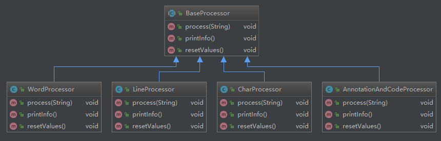

​	在`BaseProcessor`中定义了一套处理文本内容的操作，子类处理器只需要重写父类的方法，对处理对象进行不同的信息分析和提取即可，结合枚举类`Arguments` 可以看到各个处理器与参数的联系，

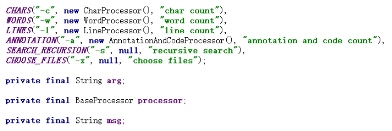

​	留意到我将负责参数分析统计的处理器设置成了枚举类的成员属性，这样做的是为了利用枚举类`单例属性`的的特点实现对处理器对象的复用，而这在避免浪费Java堆内存空间和GC收集的时间的同时也带来了不便，即每处理完一个文件都需要将处理器用于统计的属性值还原到默认值，这一处理细节将在各个处理器的`resetValue` 方法中体现。 

处理器主体方法功能介绍

- process(String line): 以行为单位进行分析处理
- printInfo():  打印处理结果
- resetValue(): 对处理器中用于统计或者状态标记的成员属性的值进行还原，为处理下一个文件做准备

### 2. 获取责任链

#### ( 1 ) BaseProcessor的设计

​	讲述如何实现获取处理链之前有必要先介绍`BaseProcessor` 的成员

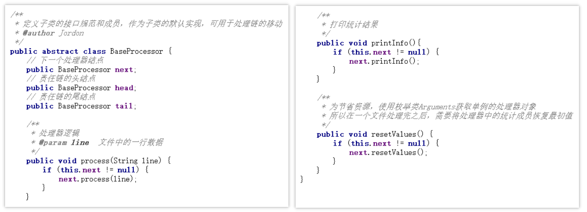

​	不难发现，一条处理链实际上就是一条`BaseProcessor` 类型的链表，由于Java继承和多态的支持，表中可以存放任何`BaseProcessor` 子类对象，每个处理器只需在执行完自己对被读取数据的解析和提取后将该数据交付给自己的下一个结点处理即可。

#### ( 2 ) 参数解析

​	由于处理器是跟表示分析统计操作的参数一一对应的，所以要构造一条处理器责任链需要先进行参数解析

​	首先看入口程序，大概地对参数做一些判断，当输入格式正常的时候去调用`ArgsPaser`的`parse`方法

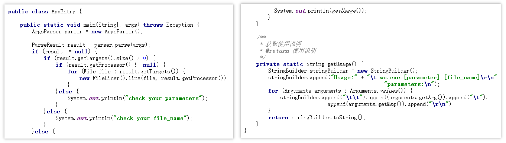

解析的大概过程

- 在`argesMatcher` 中定义枚举类与参数的映射规则
- 判断是否含有`-x` 参数，确定遍历参数数组的范围
  - 有，说明文件通过选择器获得，参数数组的最后一个元素为有效地操作参数，而不是文件路径或匹配规则
  - 无，最后一个参数为文件路径或匹配规则，在获取处理器的时候可以忽略
- 遍历参数数组，通过`argesMatcher` 获取枚举类中定义的单例处理器对象
- 通过改变处理器对象内部的引用指向，将各个处理器按序连成一条链表
- 返回处理链的头结点

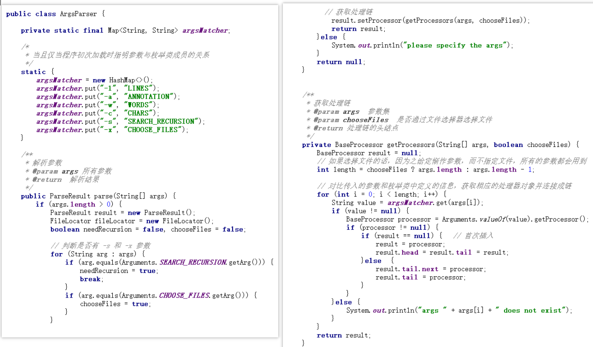

### 3. 获取待处理对象

获取待处理对象的方式有两种，一是`-x`参数对应的打开文件选择器直接选择文件，二是`-s` 参数对应的通过模式递归匹配某个目录下的所有文件，逻辑已经封装进了`FileLocator` 中， 

#### ( 1 ) 判断在上面的`ArgParser` 中的参数数组中是否含有`-s` 参数

- 有， `needRecursion` 为真，`pattern` 表示匹配模式，需要递归某个目录进行匹配查找
- 无，  `needRecursion` 为假，`pattern` 表示单个文件的路径

​                 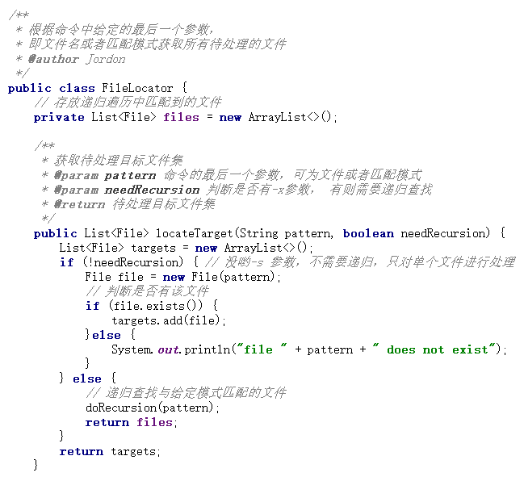

#### ( 2 ) 递归查找

- 确定进行递归的目录
  - 若`pattern` 为 `*.java` 或`?vm.c` 的形式，则从当前`exe` 执行的目录进行递归
  - 若`pattern` 为 `/usr/local/java/*.java` 的形式，则从`/usr/local/java/` 进行递归

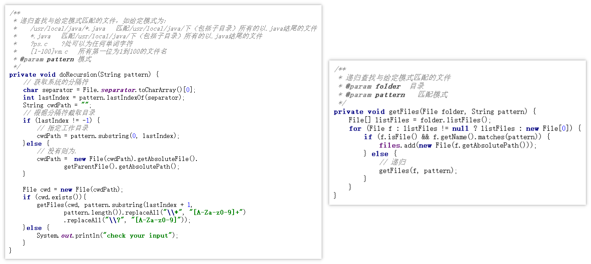

#### ( 3 ) 通过文件选择器

好久没用`Java GUI` ，也懒得去调样式了，此处的界面只做了简单的文件选择（支持多选）功能，获取到的文件集处理完仍然通过控制台打印

​                         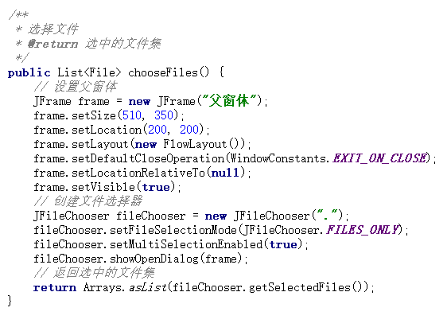

### 4. 中间代理

相当于是一个`材料分发器`， 将需要处理的文件以行为单位读取，然后扔给责任链的头结点进行处理，之前已经提过，头结点处理完之后会将该字符串交付给它的后继结点去处理

​                  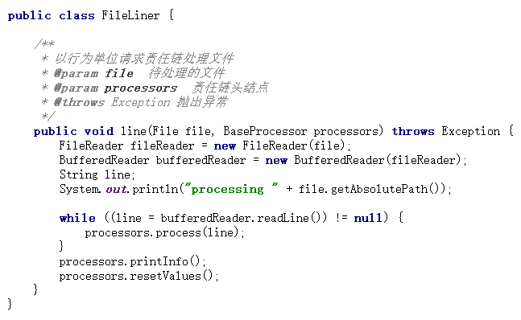

处理完之后，相应的统计结果已经存放在处理器中，打印即可，需要注意的是一定要进行`resetValue`操作，不然前一个文件的处理结果会影响后一个文件的处理结果，此过程大概流程如下图所示

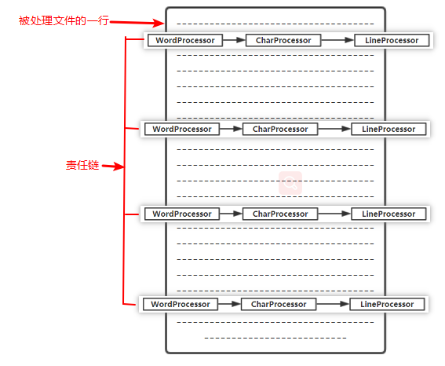

### 5. 责任链工作

#### ( 1 ) 字符和行数处理器

这两个处理器的处理逻辑相似，都是对读进来的每一行进行行数或者字符的统计，逻辑非常简单，不多说。

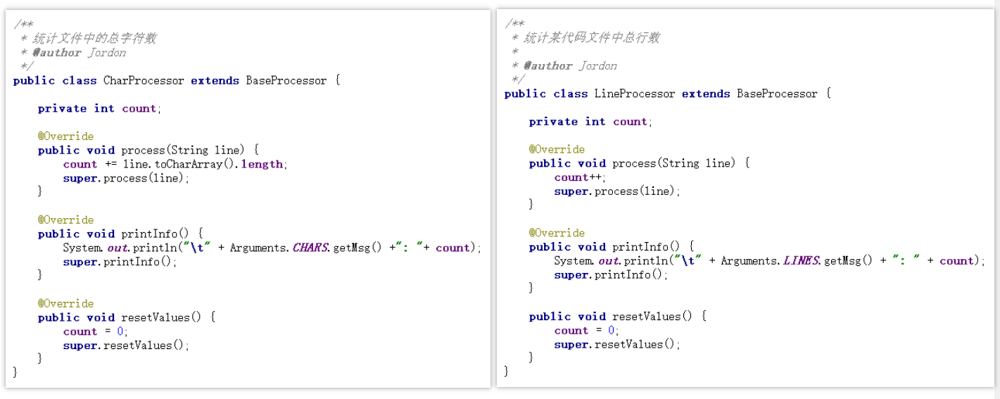

#### ( 2 ) 单词处理器

大体的过程：

- 对非单词字符进行过滤，通过分割获得单词数组
- 用`map` 记录每个单词出现的次数

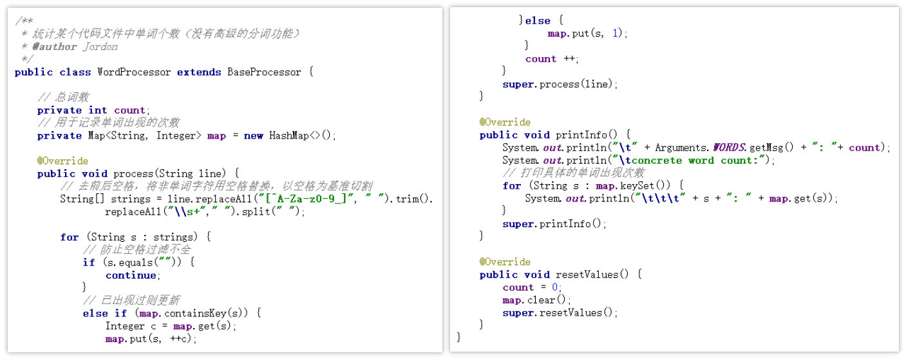

#### ( 3 ) 注释、代码行、空行处理器

用`annotationOn` 标记注释块的开始， 注意第二个跟第三个判断是不能调换的，不然将没法标记注释块的结束。

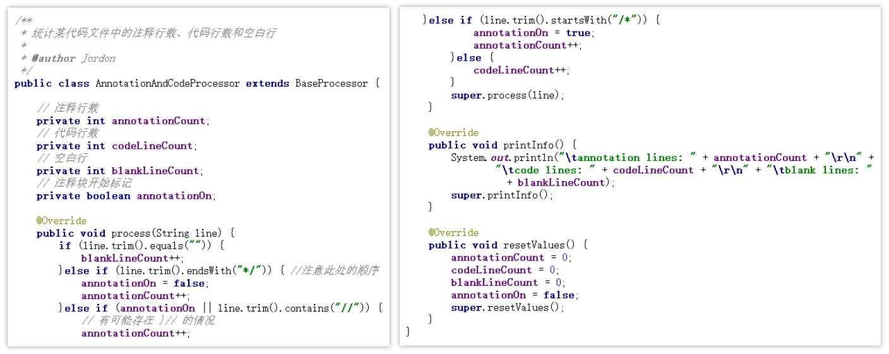

## 三. 测试运行

### 1. 命令行运行效果

#### ( 1 ) 单文件测试样例

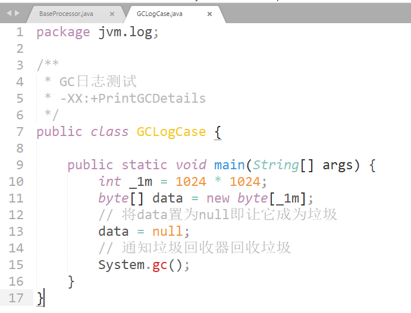

参数非法时的运行效果

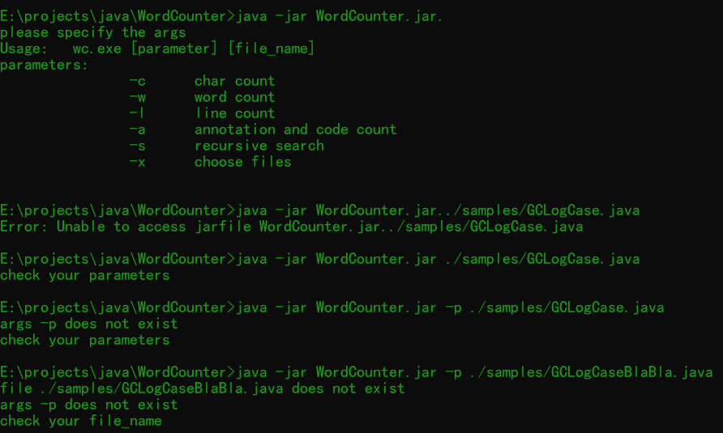

单个参数正确时的运行效果

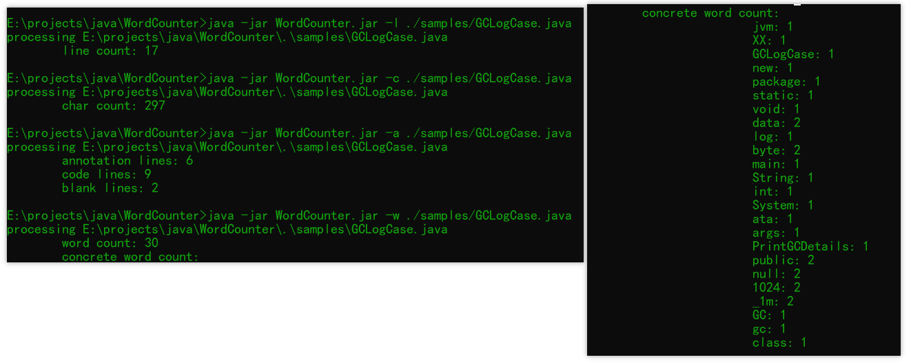

对于单个文件的多参数操作

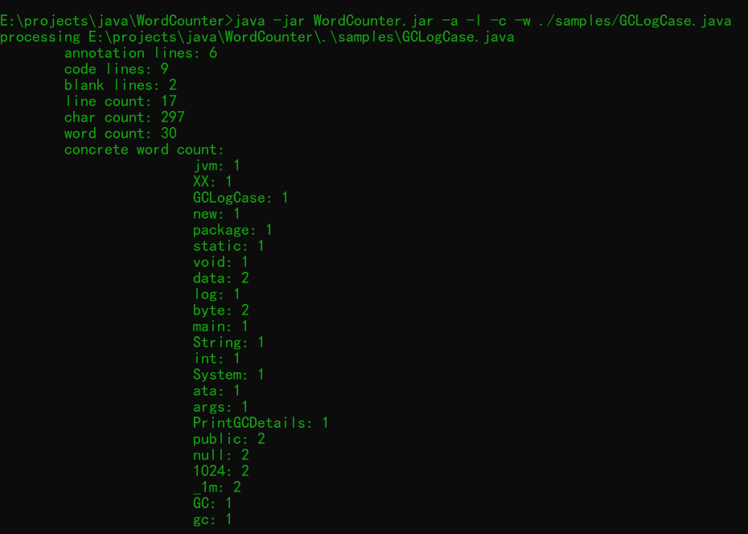

#### ( 2 ) 多文件测试样例

通过文件选择器选择带操作对象

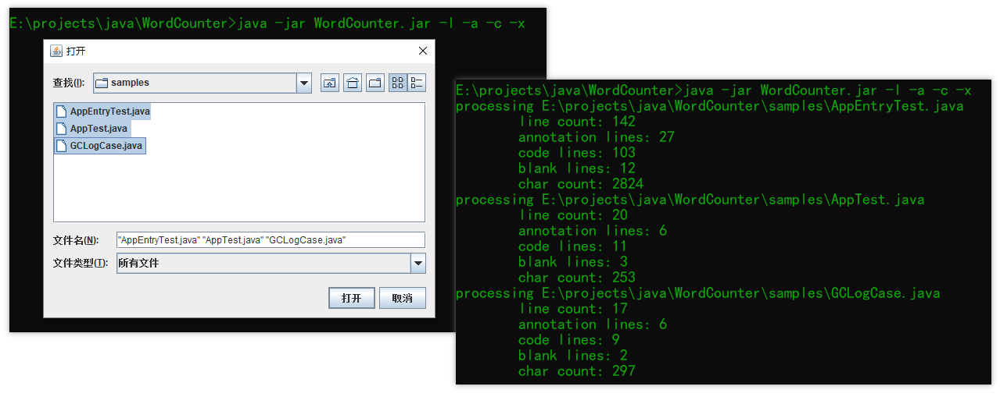

支持类似`Linux shell script` 的简单文件名模式匹配

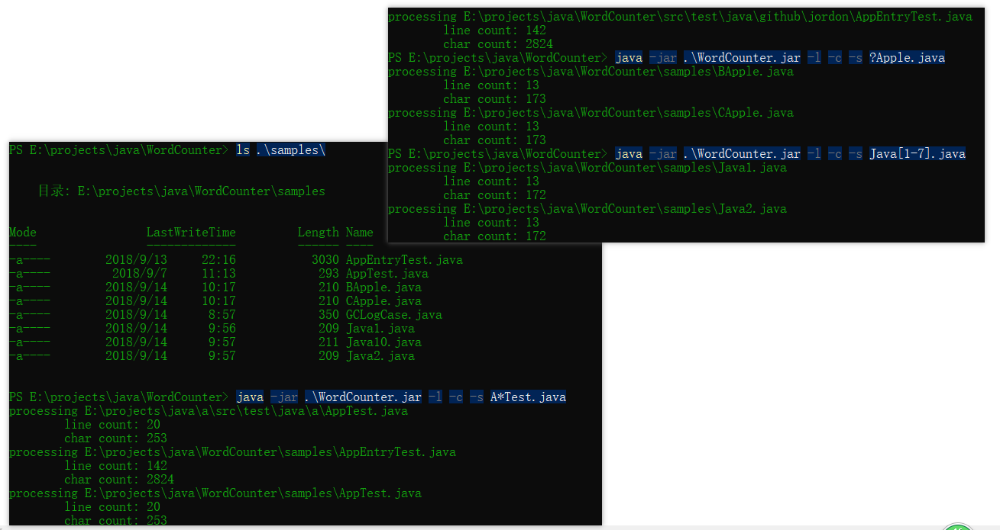

### 2. 单元测试

使用`Junit` 进行单元测试对项目进行测试，具体的测试代码见 [AppEnrtTest.java](https://github.com/jordonyang/WordCounter/blob/master/src/test/java/github/jordon/AppEntryTest.java), 测试用例可以再`samples` 文件夹中找到

### 3. 代码覆盖率

使用`org.macen.jacoco`  插件对测试代码的分支覆盖率、项目类数、方法数等信息进行分析统计，统计记过如图所示，原测试报告压缩包可以在工程目录下的`results`中找到。

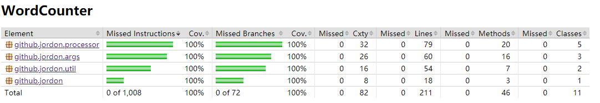

